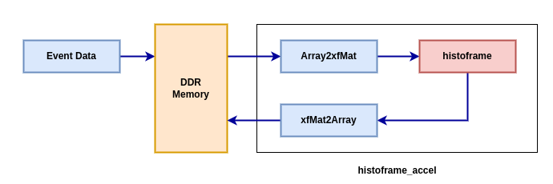

# Histoframe Generation Accelerator

histoframe_accel.cpp is the histoframe generation accelerator file which consists of following submodules:

- Array2xfMat : Data adapter for conversion of pointer to xf::Mat
- histoframe  : A custom function to generate histoframe RGB format from event-data input
- xfMat2Array : Data adapter for conversion of xf::Mat to pointer

  
  

